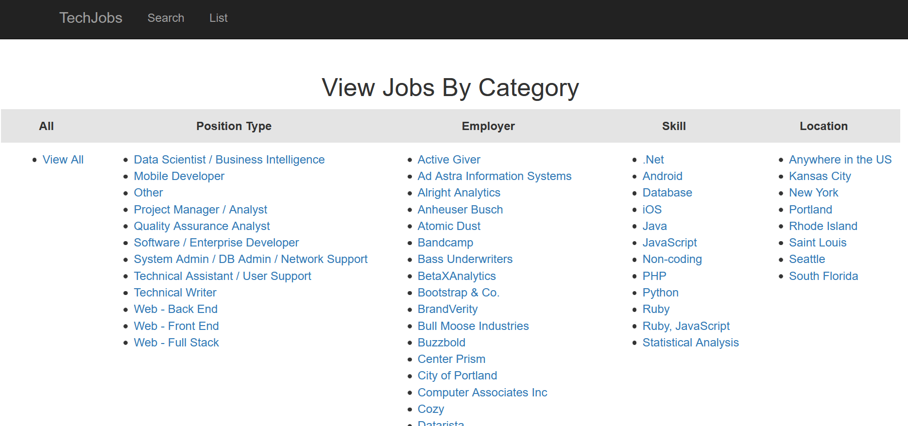
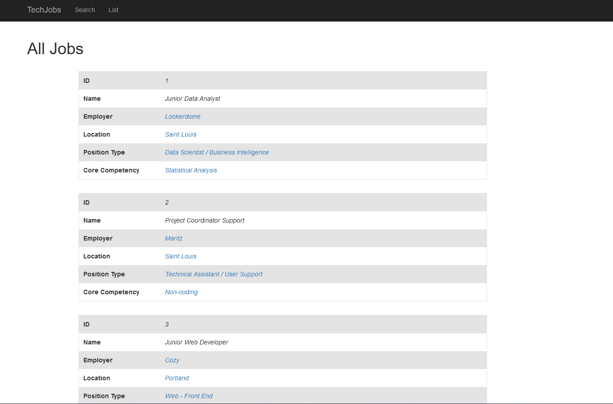
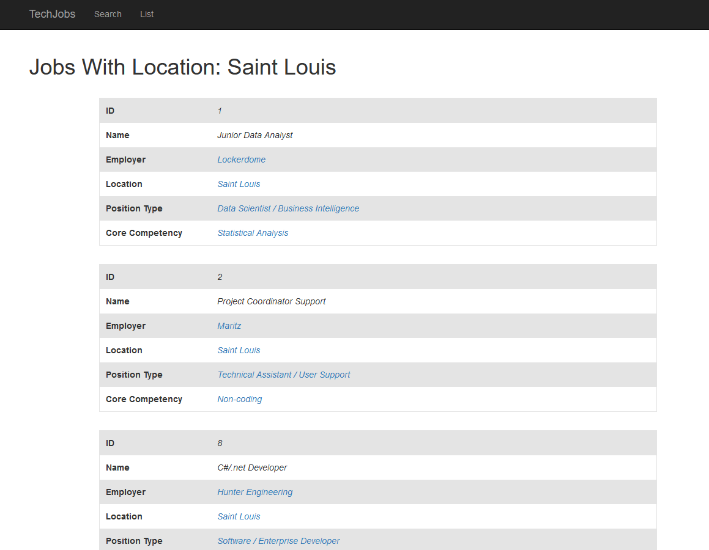
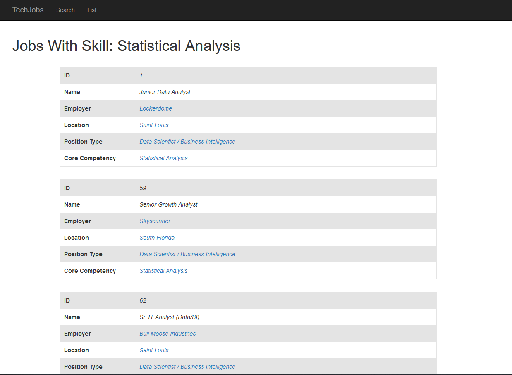
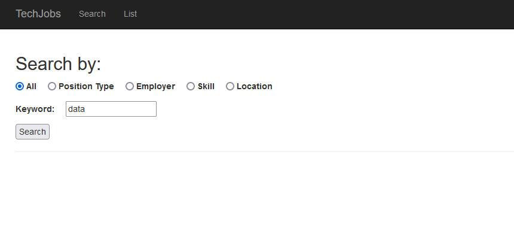
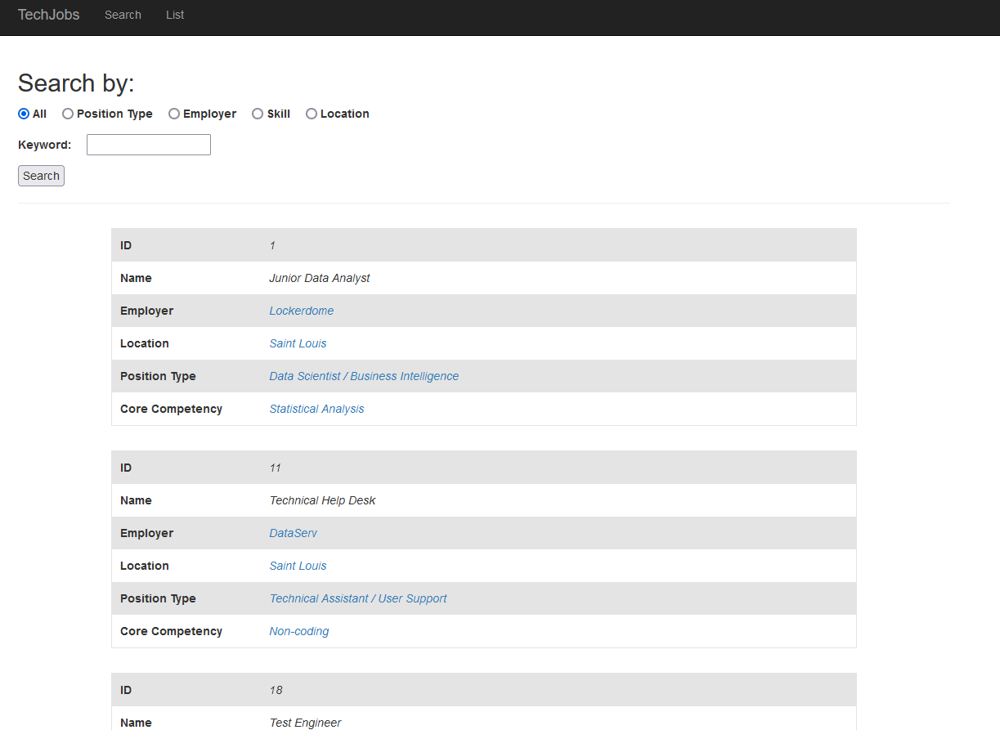
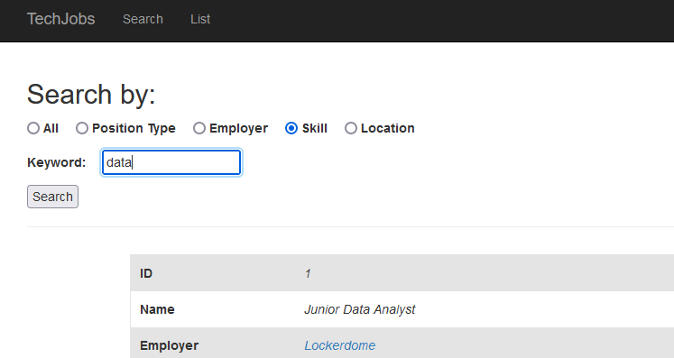
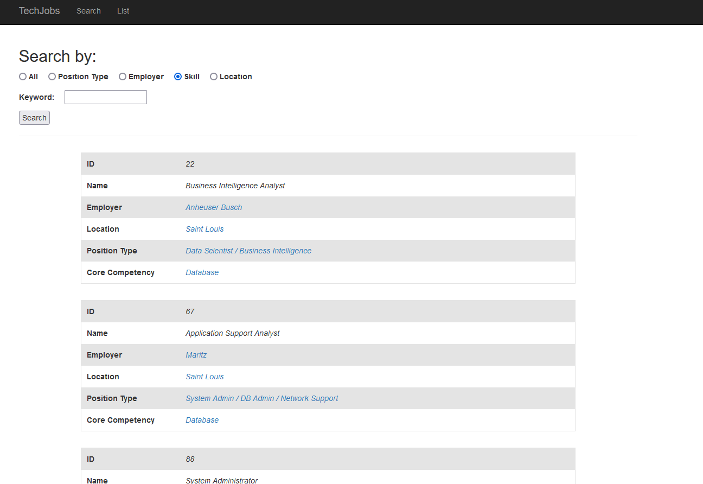
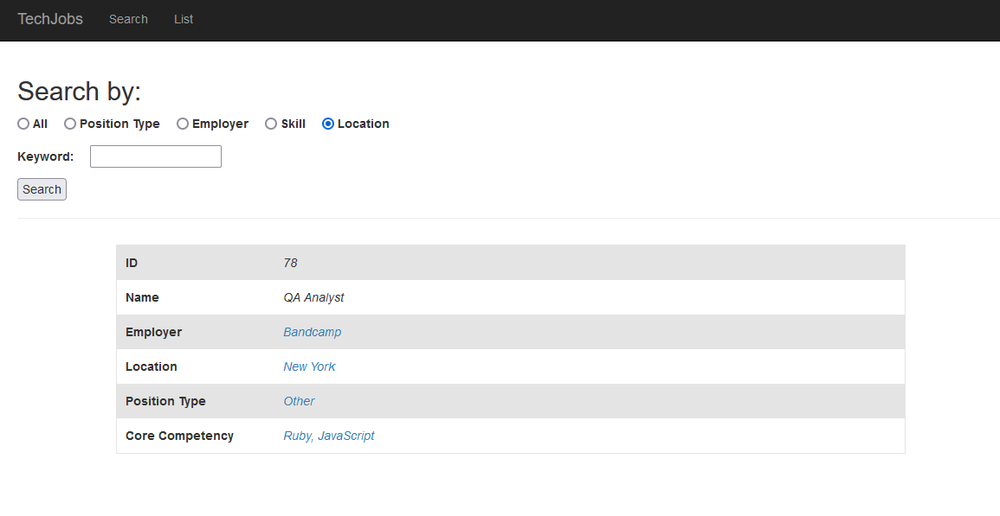

# Tech Jobs MVC

This project is an evolution of [Tech Jobs Console](https://github.com/theodoremoreland/TechJobsConsole) and [Tech Jobs OOP](https://github.com/theodoremoreland/TechJobsOOP), wherein each application
allows users to filter, search, and/or create job listings. This project evolves upon the design
and implementation of the aforementioned projects by transforming them into a web application
that uses the Model View Controller design pattern (hence "MVC").

*This project was a homework assignment for LaunchCode's Lc101 2021*

### Technologies
* Java
* Spring Boot
* Thymeleaf

# Images

## Home screen

## After clicking "List" (in navbar or link in center of page).

## After selecting "View all" from List screen. Displays every job listing.

Users can click on any of the blue values to display a list that uses the selected value as a filter.

## After clicking on the location "Saint Louis".

## After clicking on the core competency "Statistical Analysis".

## After selecting the "Search" button from navbar (has same effect as selecting from home screen).

By default, the application will select the "All" radio button for you. If you choose something else then submit,
the app will remember your selection when rendering the updated screen.

## Upon entering "data" while having "All" selected.

The application will look for the word data (while ignoring case) within each field of a job listing.
If it finds the word inside one of the fields, it will return that listing.

## Prior to searching for the word "data" in the core competency / skills category.

## After searching for the word "data" in the core competency / skills category.

Will return all listings with the word "data" in the core competency filed.

## After searching for "new york" in the location category.
